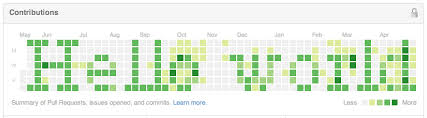

</img> 

<h1 align="center"> 🚀 DevOps Engineer  |  💻 Software Engineer Enthusiast   
  📚 Open-Source Enthusiast</h1>

<h2> 💫 About Me : </h2>
  • USA Lives in USA - Valparaiso/INDIANA. 
  • 📧 Contact me at mohankrishnan802@gmail.com 
  • 👨‍💻 I’m currently learning AWS.  
  • 💬 Ask me about IT.  
  • 🧿 View my <a href="https:/" target="_blank">Portfolio</a> 
  • 🤝 I'm open to collaborating and working on projects together.
 

<h2 align="left">🛠 Language and Tools :</h2>

  
  
  
  
  
  
  
  
  
  
  
  
  
  
  
  
  
  
    

  

 

<h2 align="left"> ✍️ Random Dev Quote :</h2>

---

